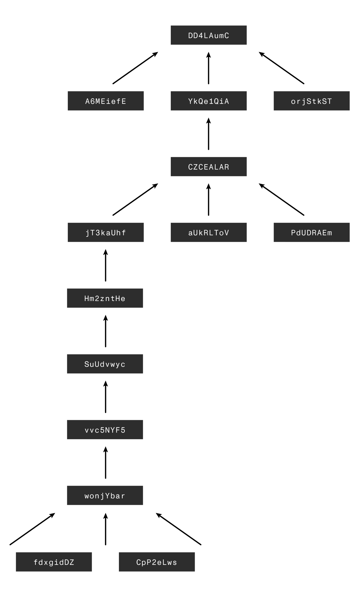

# SNARK Workers

大多数协议仅有一组主要的节点运营者(常被称作矿工, 验证者或区块生产者), 而 Mina 有第二组——**SNARK worker**. 

SNARK worker 对于 Mina 网络的健康运行至关重要, 因为这些节点负责为网络中的交易生成 SNARK 证明(以下简称"生成 SNARK 证明"). SNARK worker 通过生成这些证明来维持 Mina 区块链的简洁性. 

请继续阅读, 以了解为何需要 SNARK worker、经济激励机制是如何协同的, 以及执行 SNARK 工作的操作细节. 你可以随意点击进入与你需求最相关的部分. 

注意：本文不涵盖 zk-SNARKs 的理论知识. 阅读本节内容并不要求对 SNARK 有深入了解, 但大致知晓 SNARK 的工作原理及其用途会有所帮助. 如需了解更多内容, 可先查看这篇 [What are zk-SNARKs?](https://minaprotocol.com/blog/what-are-zk-snarks)入门文章. 

## Why SNARK Workers?

Mina 的独特之处在于其简洁的区块链. 每个区块生产者在向网络提议一个新区块时, 还必须随该区块附上一个 zk-SNARK. 这使得节点能够丢弃所有已最终确定的历史数据, 仅保留 SNARK 即可. 如果你不熟悉 Mina 协议, [this video is a good start](https://www.youtube.com/watch?v=eWVGATxEB6M). 

然而, 对于 Mina 中的区块生产者来说, 仅生成区块的 SNARK 证明是不够的. 交易也需要生成 SNARK 证明. 原因在于区块链的 SNARK 并不会对区块中所包含交易的有效性做出任何说明. 

例如, 假设当前区块链的链头有一个状态哈希值"a6f8792226...", 然后我们收到一个新区块, 其状态哈希值为"0ffdcf284f...". 这个新区块将包含区块生产者选择纳入其中的所有交易以及相关元数据. 我们还会收到一个与之配套的 SNARK, 它能验证如下陈述：

> "存在一个状态哈希值为0ffdcf284f的区块, 该区块扩展了区块链, 其之前的最佳链头状态哈希值为a6f8792226. "

请注意, 这个陈述并未提及新区块中所包含交易的有效性. 如果我们仅仅相信这个 SNARK, 而不做其他任何事, 那么我们可能会被发送该区块的恶意区块生产者所欺骗. 幸运的是, 我们有原始区块, 并且可以检查每笔交易以确保其有效性. 但对于网络中那些可能只想接收证明而不想验证每个区块的节点来说, 情况又如何呢? 

## Snarking Transactions 

为了确保节点可以在 Mina 区块链上无信任下运行, 每个节点都可以验证链的状态而无需重放交易尤为重要. 为了做到这一点, 链 SNARK 是不够的. 我们需要知道交易也是有效的. 由于 SNARKs 正好擅长于此, 因此一个天真的建议是每笔交易进来时生成一个 SNARK, 然后将它们组合起来. 

然而, 生成 SNARK 证明的计算成本很高. 如果我们必须为每笔交易串行地计算 SNARK, 吞吐量将非常低, 区块时间会飙升. 此外, 真实环境中的交易是异步到达的, 因此很难预测何时执行下一项工作. 

幸运的是, 我们可以利用 SNARK 的两个属性: 

1. 证明可以合并 -- 两个证明可以组合形成一个合并证明
2. 合并是相关联的 -- 合并证明是相同的, 无论合并顺序如何.

这两个属性本质上允许我们做的是利用并行性. 如果证明可以合并, 并且它们如何组合并不重要, 那么 SNARK 证明可以并行生成. 先完成的证明可以稍后与正在进行的证明合并. 这可以设想为一棵二叉树, 其中叶子节点由单个交易证明组成, 每个父节点由相应的合并证明组成. 我们可以将它们一直组合到根节点, 它表示通过应用所有交易来执行状态更新. 

此外, 由于 SNARK 证明彼此不依赖, 我们可以利用并行性, 这意味着任何人都可以完成这项工作! 最终结果是分布式 work pool 是 permission-less. 任何拥有空闲算力的人都可以作为 SNARK worker 加入网络, observe 需要 SNARKed 的交易, 并贡献他们的算力. 当然, 他们将因在我们称为 snarketplace 里的工作而获得报酬. 

注意：要了解有关此 SNARK 工作机制如何演变的详细信息, 强烈建议观看此视频: [使用 Slow Snarks 实现高吞吐量](https://www.youtube.com/watch?v=NZmq1V-Te0E). 如果您对函数式编程和扫描状态(上述树结构)的详细信息感兴趣, 我们有一个介绍技术详细信息的[视频](https://www.youtube.com/watch?v=ztH_Z5TCe9I). 

## The Snarketplace

理解 SNARK 工作的关键在于: 

_区块生产者使用他们的区块奖励从 SNARK worker 那里 SNARK 工作._

在 snarks 的定价方面, 协议并不参与其中, 对于 SNARK worker 生成 snarks, 协议层面也没有奖励. 激励机制纯粹是点对点的, 并在一个公开市场(the snarketplace)中动态建立. 

你可能会问, 为什么区块生产者需要购买 SNARK 呢? 这是个合理的问题--原因正如我们之前提到的那样. 为了确切知晓 Mina 区块链链头的状态是有效的, 交易需要生成 SNARK 证明. 但是, 如果我们不断添加更多交易, 却不以相同的速率为它们生成零知识证明(进行snarking操作), 那么随着时间的推移, 我们就会积压未完成的工作. 为了达到稳定的状态平衡, 我们需要以大致与添加工作相同的速率来处理工作. 

由于区块生产者通过在区块中包含交易获利(通过交易手续费和 coinbase 交易), 他们有责任通过购买等量已完成的 SNARK 工作来抵消这些交易, 从而产生了对 SNARK 工作的需求. 然而, 他们的当务之急是从 snarketplace 以最低价格购买 SNARK 工作. 相反, SNARK worker 则希望在能够售出自己的 SNARK 工作的同时实现利润最大化. 这两个角色构成了市场的供需双方, 并随着时间的推移在 SNARK 工作的市场价格上达成一种平衡. 

### How to price SNARK work 

我们预计 snarketplace 会动态平衡--例如, 遵循 [supply and demand](https://en.wikipedia.org/wiki/Supply_and_demand) 的基本规律. 虽然每项 SNARK 工作都对应不同的交易, 但从更宏观的角度来看, SNARK 工作在很大程度上属于一种商品(意味着由哪个 SNARK worker 来生成并不重要--结果都是一样的). 然而, 其中存在一些细微差别, 因此制定一些定价策略的启发式方法可能会有所帮助: 

- 如果市场价格为 X, 只要扣除运营费用后仍有盈利, 以低于 X 的任何价格(例如 X - 1) 出售 SNARK 工作可能都是有效的. 
- 区块生产者有动力从同一 SNARK worker 那里购买更多单位的 SNARK 工作, 因为这样他们只需在区块中包含一笔"费用转移"交易即可. 
    - 基本上, 区块生产者向 SNARK worker 付款的方式是通过一种名为"费用转移"的特殊交易类型. 区块生产者的动机是尽量减少费用转移的次数, 因为每一笔费用转移都是一笔需要添加到区块中的独立交易(并且相应地需要更多的 SNARK 工作来抵消). 因此, 最佳情况是从同一 SNARK worker 那里购买一批 SNARK 工作. 
- 有些 SNARK 工作比其他工作更重要, 需要优先完成, 因为这将释放整棵树所占用的内存(如需更多详细信息, 请观看上述视频). 这可以通过不同的工作选择方法来实现. 目前, 原生支持的三种方法有顺序选择法、随机选择法以及带有随机偏移的顺序选择法. 然而, 这些方法都没有利用动态市场, 这是一个有待改进的方面, Mina 社区可以针对此开发解决方案. 

由于所有与 snarks 和价格相关的数据都是公开的, 所以有几种方式可以查看 snarketplace. 例如[using the GraphQL API](https://youtu.be/XQlfX-LnK_A), 其他选择还包括使用命令行界面, 或者自行定制一个跟踪 SNARK 内存池中的 snarks 的解决方案. 

请持续关注关于 snarketplace 动态的更详细分析. 我们不久后还将发布一份经济白皮书, 它将提供更多相关背景信息. 

另请参阅: [SNARKs and SNARK Workers FAQ](./node-operators/faq.md#snarks-and-snark-workers)